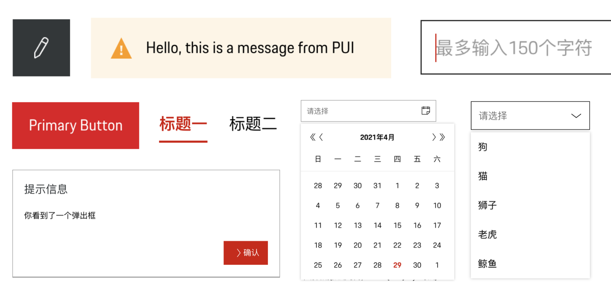

<div align="center">
  <picture>
    <source media="(prefers-color-scheme: dark)" srcset="./logo-dark.svg" />
    
  </picture>
</div>

<div align="center">
A Porsche styled enterprise React UI library.
<div>
<div align="center">
  <a href="https://www.npmjs.com/package/vitest"></a>
<div>

<div align="center">
 <a href="https://porsche-design-system.github.io/porsche-design-system-china/docs/">Documentation</a> | <a href="https://porsche-design-system.github.io/porsche-design-system-china/docs/?path=/docs/coding-develop-pui--docs">Develop PUI</a> | <a href="https://porsche-design-system.github.io/porsche-design-system-china/docs/?path=/docs/coding-change-logs--docs">Change Logs</a> | <a href="https://github.com/porsche-design-system/porsche-design-system-china/blob/develop/NOTICE.txt">Open Source Software Notice</a>
</div>


## ✨ Features

- Porsche styled components, fonts, icons, themes
- Powerful form handling

<br/>
<br/>

## 📦 Install

```sh
npm install @pui-cn/react
```

<br/>
<br/>

## 🔨 Usage

```ts
import { Button } from '@pui-cn/react';

export const Page = () => {
  return <Button>按钮</Button>;
};
```

<br/>
<br/>

## 🤝 Contribution

See [Contributing Guide](./CONTRIBUTING.md)

<br/>

<br/>

## License

[LICENSE](./LICENSE.md) License © 2021-Present
